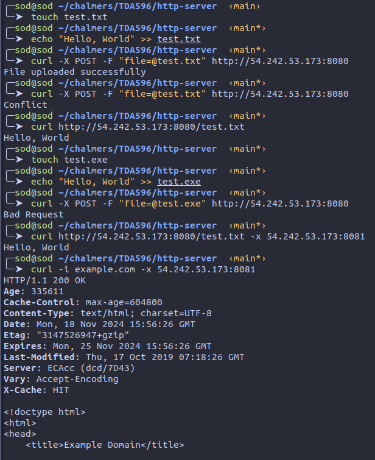
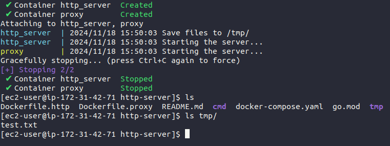

# HTTP Server & Proxy

This repository contains two applications: a simple HTTP server and a simple proxy server.

## HTTP Server

The source code for this application is located at `cmd/http_server`.

### Features

This HTTP server provides the following functionalities:

1. Saves a file using an HTTP POST request.
2. Loads a file using an HTTP GET request.
3. Accepts only files with the following extensions: `html`, `txt`, `gif`, `jpeg`, `jpg`, or `css`.

The application is implemented using only the `net` package from the Go standard library. It should be noted that `net/http` is used merely as a helper to parse HTTP requests and generate HTTP responses. Additionally, the server's number of workers can be limited by adjusting the `kMaxNumOfWorkers` parameter in `http_server.go`.

### Running the HTTP Server

To start the server, use the following command:

```sh
http_server <port> [path-to-save-files]
```

A Dockerfile (`Dockerfile.http`) is provided to containerize the application. This Dockerfile builds an image that contains only the final compiled binary.

## Proxy Server

The source code for this application is located at `cmd/proxy`.

### Features

This proxy server provides the following functionalities:

1. Forwards HTTP requests to the corresponding host.
2. Rejects all HTTPS requests except for GET requests.

The application is implemented using only the `net` package from the Go standard library. Similar to the HTTP server, `net/http` is used as a helper to parse HTTP requests and generate HTTP responses.

### Running the Proxy Server

To start the proxy server, use the following command:

```sh
proxy <port>
```

A Dockerfile (`Dockerfile.proxy`) is provided to containerize the application. This Dockerfile builds an image that contains only the final compiled binary.

## Testing

Basic tests have been written for both applications. You can run the tests using the following command:

```sh
go test ./...
```

## Deployment

Since Dockerfiles are provided for both applications, their images can easily be pushed to a Docker registry and pulled later for deployment. However, to simplify deployment without needing a Docker registry and to facilitate easy management of both applications, a Docker Compose file has been written to deploy both applications at once.

### Deployment with Docker Compose

To deploy both applications using Docker Compose on an instance or VM (e.g., EC2), assuming Docker is already installed, run the following commands sequentially:

```sh
git clone <this-repository>
cd <this-repository>
docker compose -f docker-compose.yaml up --build -d
```

### Example Deployment

The deployment environment was an AWS EC2 t2.micro instance.

Both the HTTP server and proxy server were run, and several successful and unsuccessful scenarios were tested:



Results from the AWS instance:


